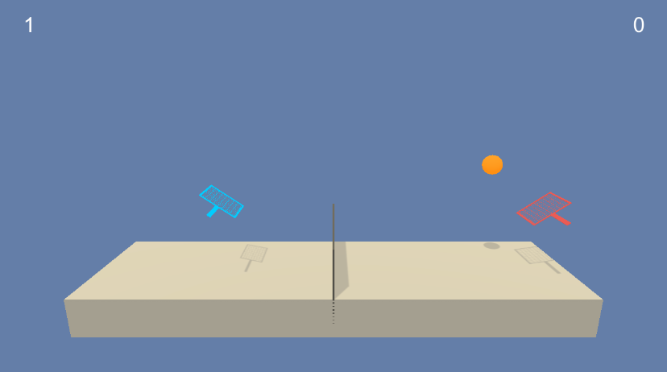
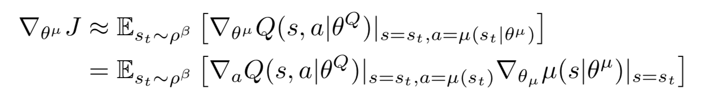
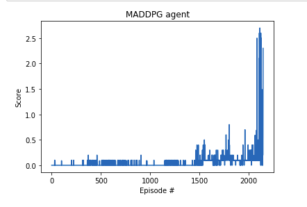
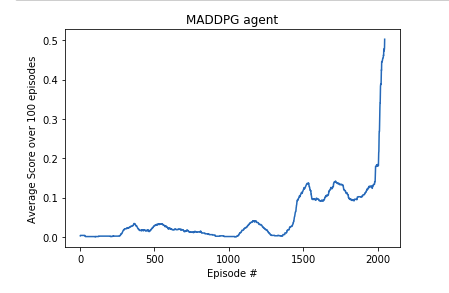

# Tennis Rally: Multiagent reinforcement learning for a cooperative task.

For this project, you will work with the Tennis environment.

In this environment, two agents control rackets to bounce a ball over a net. If an agent hits the ball over the net, it receives a reward of +0.1. If an agent lets a ball hit the ground or hits the ball out of bounds, it receives a reward of -0.01. Thus, the goal of each agent is to keep the ball in play.

The observation space consists of 8 variables corresponding to the position and velocity of the ball and racket. Each agent receives its own, local observation. Two continuous actions are available, corresponding to movement toward (or away from) the net, and jumping.

The task is episodic, and in order to solve the environment, your agents must get an average score of +0.5 (over 100 consecutive episodes, after taking the maximum over both agents). Specifically,

After each episode, we add up the rewards that each agent received (without discounting), to get a score for each agent. This yields 2 (potentially different) scores. We then take the maximum of these 2 scores.
This yields a single score for each episode.
The environment is considered solved, when the average (over 100 episodes) of those scores is at least +0.5.

 

The following report is written in four parts:

- **Implementation**

- **Results**

- **Ideas for improvement** 

  

## Implementation

The basic algorithm lying under the hood is an actor-critic method. Policy-based methods like REINFORCE, which use a Monte-Carlo estimate, have the problem of high variance. TD estimates used in value-based methods have low bias and low variance. Actor-critic methods marry these two ideas where the actor is a neural network which updates the policy and the critic is another neural network which evaluates the policy being learned which is, in turn, used to train the actor.

In vanilla policy gradients, the rewards accumulated over the episode is used to compute the average reward and then, calculate the gradient to perform gradient ascent. Now, instead of the reward given by the environment, the actor uses the value provided by the critic to make the new policy update.

[Deep Deterministic Policy Gradient (DDPG)](https://arxiv.org/abs/1509.02971) lies under the class of Actor Critic Methods but is a bit different than the vanilla Actor-Critic algorithm. The actor produces a deterministic policy instead of the usual stochastic policy and the critic evaluates the deterministic policy. The critic is updated using the TD-error and the actor is trained using the deterministic policy gradient algorithm.

  

- **Ornstein-Uhlenbeck noise**: The Ornstein-Uhlenbeck noise process in this project had to add noise to the actions for both agents. So, the dimensions of the Tensor storing the noise values is (num agents, num_actions).

The score for cach episode was the maximum of the scores of the two agents for that episode. So the corresponding code was added in the training loop.

- **Actor and Critic Network Architecture**: Both the Actor and the Critic networks have 2 hidden layers each. In both networks, the lst layer has 400 neurons while the 2" has 300 neurons. All hidden layers are followed by Batch Normalization layers and then ReLU activation. In Actor network, final layer contains number of neurons (= #actions), followed by tanh activation. In the Critic network, final layer contains only one neuron.
Since the critic network estimates Q-values for all state-action pairs, we have to somehow insert the corresponding actions at some layer. We do this in the
second hidden layer of the Critic network.

### Hyperparameters

There were many hyperparameters involved in the experiment. The value of each of them is given below:

| Hyperparameter                      | Value |
| ----------------------------------- | ----- |
| Replay buffer size                  | 1e5   |
| Batch size                          | 512   |
| $\gamma$ (discount factor)          | 0.99  |
| $\tau$                              | 1e-3  |
| Actor Learning rate                 | 1e-3  |
| Critic Learning rate                | 1e-3  |

## Results

The algorithm was able to solve the environment in approximately 2050 episodes.

Note: I was able to achieve this after performing training for multiple times.
First time, I was able to solve the environment in about 3200 episodes while in
some runs, the score kept oscillating between 2 values. In the gth run, I was
able to achieve the aforementioned claim. So, in my view, my implementation
is quiet unstable and would be implementing better techniques as mentioned in
the Future Work section.   

## Ideas for improvement

Implementing multiple actors and shared critic approach as mentioned in this [MADDPG)](https://arxiv.org/pdf/1706.02275.pdf) paper because it involves information sharing between the agents which in turn has said to be efficient in the module on Multi-Agents Reinforcement learning.
